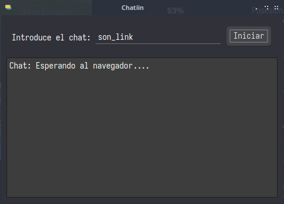
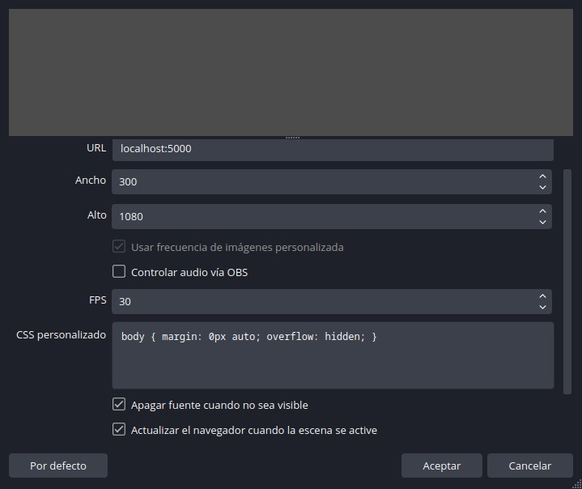

# Chatiin

Chatiin es una aplicación en progreso de desarrollo que permite crear y personalizar un chat de Twitch para mostrarlo en OBS a traves del plugin del navegador. Este proyecto nacio por la necesidad de poder personalizar dicho chat en OBS para los directos de [Jugando En Linux](https://jugandoenlinux.com) sin recurrir a servicios de terceros

Por el momento solo contiene lo básico y muchas funcionalidades aun no están implementadas y/o pueden cambiar a lo largo del desarrollo.

## Instalación

### Ejecutables

De momento solo hay un ejecutable para Linux. Solo tienes que ir a Releases y descargar la AppImage, darle permisos de ejecución y hacer doble click sobre el.

### Desde el código fuente.

Se requiere al menos Node.js 18 y npm para instalar los módulos.

Descarga el código fuente, abre una terminal y ejecuta el siguiente comando para instalar los módulos necesarios:

```sh
npm install
```

Una vez instalados para arrancar el programa ejecuta el siguiente comando:

```sh
npm run start
```

### Uso

Una vez arrancada la aplicación se mostrara una ventana. En el campo de texto superior introduce tu canal, que es la parte final de la URL a tu canal (más adelante también se podrá introducir la URL completa). Una vez hecho pulsa en el botón iniciar.



Una vez hecho esto abre OBS e introduce en el plugin del navegador la siguiente dirección: localhost:5000.



### Agradecimientos

Al equipo detrás de Jugando En Linux, a Leillo por proponer el nombre y que fue el más votado por parte de la comunidad, y a todos/as/es vosotros/as/es por descargarlo, usarlo, etc.